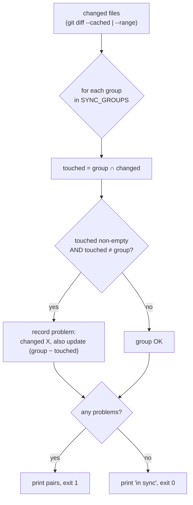

# Slice: S-000 — Agent workflow + Cursor↔Claude parity bootstrap

| Field | Value |
|---|---|
| **Slice ID** | S-000 |
| **Phase** | 0 Bootstrap |
| **Status** | Accepted |
| **Owner** | PM / 2026-08-29 |

> **Worked example.** This is the first slice run through the full
> `PM → Architect → Builder → Tester → PM` cycle. It ships no product code — only the machinery that
> keeps Cursor and Claude Code in sync and the slice cycle usable. Wave 3 (`S-001`) is the first
> product slice.

---

## User story

**As a** maintainer working across both Cursor and Claude Code
**I want** the two tools' agent config to be provably in sync, with templates for every workflow artifact
**So that** a session started in either tool has the same rules and roles, and a one-sided rule edit
is caught before it merges

---

## Acceptance criteria

1. **Given** `SYNC_GROUPS` and the parity script, **when** a commit stages a change to exactly one
   file of a sync pair (e.g. `.cursor/rules/agents/role-tester.mdc`) and not its mirror
   (`.claude/agents/tester.md`), **then** `python scripts/check_agent_config_sync.py --staged` exits
   non-zero and names the file that also needs updating.
2. **Given** the same script, **when** a commit stages **both** files of a pair, **then** the script
   exits 0.
3. **Given** the CI workflow `.github/workflows/agent-config-sync.yml`, **when** a pull request is
   opened, **then** it runs `check_agent_config_sync.py --range <base>...<head>` (i.e. the check is
   wired to `pull_request`, not dispatch-only).
4. **Given** `.githooks/pre-commit` is enabled (`git config core.hooksPath .githooks`), **when** a
   commit is attempted on `main` or `master`, **then** the hook refuses it and tells the user to
   branch.
5. **Given** the hook is enabled, **when** a commit on a feature branch stages a one-sided pair edit,
   **then** the commit is blocked by the sync check.
6. **Given** `docs/agents/`, **when** a maintainer starts any workflow artifact, **then** a
   `_TEMPLATE.md` exists for each of: slices, adrs, test-plans, test-reports.
7. **Given** the parity table in the root `CLAUDE.md` and `SYNC_GROUPS` in the script, **when** the
   two are compared, **then** every Cursor rule in the table maps to a group in the script and every
   group maps to a table row — no drift.
8. **Given** `README.md`, **when** opened, **then** it links `mvp-spec.md`, the three Wave 1 docs,
   `AGENTS.md`, the `CLAUDE.md` parity table, `docs/agents/`, `docs/roadmap.md`, and
   `docs/claude-implementation-waves.md`.
9. **Given** `docs/roadmap.md`, **when** opened, **then** it has a seeded row (status / target /
   why-not-v0 / spec pointer) for at least: Flutter, Stripe, packs, competitor compare, infographics,
   seats, Hindi, authenticator TOTP, SMS OTP, public name, model bake-off, single-session, prompt
   cache, screenshot teaser, Scale.
10. **Given** the three `.claude/agents/*.md` files, **when** inspected, **then** each has `name`,
    `description`, and `tools` frontmatter and a "Parity" line pointing at its `.mdc` mirror.

---

## UX notes

No UI. Developer-facing only. Artifacts render on GitHub (mermaid must parse — `;` is a mermaid
statement separator, use `,` in message text).

---

## Out of scope

- Any FastAPI / Next.js code (Wave 3 / `S-001`).
- `docker-compose.yml` and app-test CI workflows (Wave 3).
- Nested `backend/app/models/` and `backend/app/services/` `CLAUDE.md` files — created in Wave 3 when
  the code lands; tracked in `docs/roadmap.md`.
- Builder rules for `ai-and-integrations` / `database` as separate files — folded into
  `backend-fastapi.mdc` / `backend/CLAUDE.md` until Wave 3.

---

## Dependencies

- Wave 1 docs (`docs/architecture.md`, `docs/architecture-sequences.md`, `docs/ai-touchpoints.md`) — **Accepted** (commit `c19da23`).

---

## Definition of done (PM)

- [x] All AC verified in the test report ([`TR-S-000-agent-bootstrap.md`](../test-reports/TR-S-000-agent-bootstrap.md))
- [x] `docs/roadmap.md` seeded; `mvp-spec.md` untouched
- [x] `README.md` index + status table updated
- [x] PM `Status` set to **Accepted**

---

## Technical specification (Architect)

### API contract

**N/A** — this slice adds no HTTP surface. No `/v1` route, no request/response schema.

### Data model impact

- [x] None  [ ] Extend existing  [ ] New table(s) — Alembic migration: **no**

### Inference & money (cross-ref `docs/ai-touchpoints.md`)

- **LLM call in this slice?** No. Zero production AI hops.
- **Quota effect?** None.
- **Who sets prices?** N/A — no proposal path touched.
- `docs/ai-touchpoints.md` is unchanged and still accurate: the two v0 AI hops are unaffected.

### Side effects

- Adds a **local pre-commit hook** (`.githooks/pre-commit`, opt-in via `git config core.hooksPath .githooks`):
  refuses commits on `main`/`master`, then runs the sync check on staged files.
- Adds a **CI job** (`.github/workflows/agent-config-sync.yml`) on `pull_request` + push to `main`.
  For it to be non-bypassable it must be added as a required status check in branch protection
  (a GitHub Settings action, outside this repo).
- `.gitattributes` forces LF on `.githooks/*` and `scripts/*.py` so the shell hook runs under Git
  Bash on Windows clones with `core.autocrlf=true`.

### Frontend

**N/A.**

### Sync-check logic (mermaid)

### Architect checklist

- [x] API contract: N/A and stated
- [x] Data model impact: None; no migration
- [x] `docs/ai-touchpoints.md` still accurate (zero AI hops in this slice)
- [x] Money / `proposal_json` / JWT: not touched
- [x] No secrets in the design
- [x] No contradiction with any Wave 1 doc

### Risks / tradeoffs

- **Coarse coupling:** `CLAUDE.md`, `backend/CLAUDE.md`, `frontend/CLAUDE.md` each sit in two sync
  groups, so editing one of them demands touching two `.mdc` files. Accepted — it matches the
  MEngPlat pattern and in practice a convention change touches both sides anyway.
- **Hook and CI are opt-in / need branch protection.** The hook does nothing until
  `git config core.hooksPath .githooks`; the CI job isn't a merge gate until it's a required check.
  Documented in `AGENTS.md`.
- **`--no-verify` bypasses the local hook.** GitHub branch protection is the real lock.

---

## Links

- Test plan: [`TP-S-000-agent-bootstrap.md`](../test-plans/TP-S-000-agent-bootstrap.md)
- Test report: [`TR-S-000-agent-bootstrap.md`](../test-reports/TR-S-000-agent-bootstrap.md)
- ADR: none

---

## Changelog

| Date | Agent | Change |
|---|---|---|
| 2026-08-29 | PM | Created slice, drafted 10 AC |
| 2026-08-29 | Architect | Tech spec: N/A API, zero AI hops, sync-check flow, risks |
| 2026-08-29 | Builder | Created `.cursor/rules/**`, `CLAUDE.md` (root + nested), `.claude/agents/**`, `AGENTS.md`, `scripts/check_agent_config_sync.py`, `.githooks/pre-commit`, CI workflow, 4 templates, seeded `docs/roadmap.md`, updated `README.md` |
| 2026-08-29 | Tester | Ran the sync script (one-sided fail, two-sided pass), verified templates + parity-table/SYNC_GROUPS match + README links. Ship. |
| 2026-08-29 | PM | All 10 AC mapped and passing → **Accepted** |
