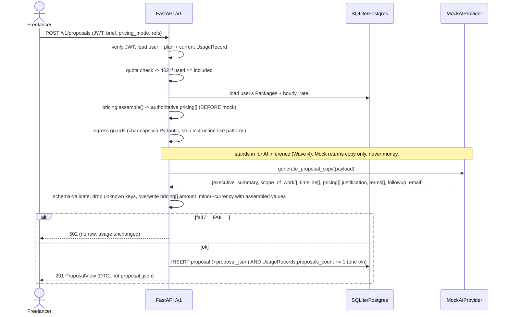

# Slice: S-001 — Platform skeleton (auth, profile, proposals CRUD, quota — LLM dark)

| Field | Value |
|---|---|
| **Slice ID** | S-001 |
| **Phase** | 1 Platform skeleton |
| **Status** | Accepted |
| **Owner** | PM / 2026-08-29 |

> **Wave 3.** Proves JWT verification, `/v1/me` profile + packages, proposals CRUD, the PATCH
> allowlist, and the quota counter **without a live model**. The AI adapter returns deterministic
> mock structured copy. No Razorpay live keys — mock payment adapter + HMAC webhook stub. PDF is a
> stubbed `pdf_url`. The Next.js client is **S-002** (not this slice).

---

## User story

**As a** freelancer
**I want** to sign in, save my packages / hourly rate, and create + edit proposals that use my numbers
**So that** the workflow is real end-to-end before the model and payments are switched on

---

## Acceptance criteria

**Auth**

1. **Given** no `Authorization` header, **when** I call any `/v1/*` route except `/v1/health`, **then** I get `401`.
2. **Given** a JWT that fails signature / `exp` / `aud` verification, **when** I call a `/v1` route, **then** I get `401` and no handler logic runs.
3. **Given** a valid Supabase JWT for a `sub` with no `users` row, **when** I call `GET /v1/me`, **then** a `users` row is provisioned on first use and the profile is returned with `plan = free`.

**Profile & packages**

4. **Given** I am authenticated, **when** I `PUT /v1/me` with `quote_currency`, `hourly_rate`, and 1–3 packages `{label, amount_minor}`, **then** they are persisted and `GET /v1/me` returns them plus `{plan, usage:{included, used, period_end}}`.
5. **Given** I `PUT /v1/me` with a non-integer amount or a currency outside `USD/INR/EUR/GBP`, **then** I get `422` and nothing is saved.

**Generate (mock model)**

6. **Given** I am within quota with two saved packages, **when** I `POST /v1/proposals` in `packages` mode referencing both, **then** the saved `proposal_json.pricing` has exactly those two amounts/labels/currency, `usage.used` increments by 1, and the response is the **view DTO** (sections + pricing + `pdf_url: null`), never raw `proposal_json`.
7. **Given** the mock adapter is told to emit a price (payload contains the sentinel `__MODEL_TRIES_PRICE__`), **when** generate runs, **then** the persisted amounts still equal the server-assembled amounts — the model value is discarded.
8. **Given** generation fails (brief contains the sentinel `__FAIL__`), **when** I `POST /v1/proposals`, **then** I get `502`, `usage.used` is unchanged, and no proposal row is persisted.
9. **Given** I am at my included limit, **when** I `POST /v1/proposals`, **then** I get `402` with an upgrade hint, no model call, `usage.used` unchanged.
10. **Given** `hourly` mode with `hourly_rate = 500000` and options `[{label:"Basic", hours:10}]`, **then** the pricing line amount is `5000000` (rate × hours), computed server-side.

**Read / list**

11. **Given** proposals owned by me and by another user, **when** I `GET /v1/proposals`, **then** I see only my own, as view DTOs; **when** I `GET /v1/proposals/{other_id}`, **then** `404`.

**Edit (no model, no quota)**

12. **Given** one of my proposals, **when** I `PATCH` an allowlisted field (a section text, `client_name`, `status`, or a pricing line `amount_minor`/`label`), **then** it updates, `pdf_url` is set to `null`, `usage.used` is unchanged, and no model call happens.
13. **Given** a `PATCH` body with a key not on the allowlist (e.g. `proposal_json`, `user_id`, `llm_output_tokens`), **then** I get `422` and nothing changes.

**Regenerate**

14. **Given** I am within quota, **when** I `POST /v1/proposals/{id}/regenerate`, **then** the copy is replaced, prices are re-assembled from my **current** saved amounts, `pdf_url` is nulled, and `usage.used` increments by 1; failure behaves like AC 8 (no increment, old copy kept).

**Duplicate**

15. **Given** one of my proposals, **when** I `POST /v1/proposals/{id}/duplicate`, **then** a new `draft` proposal is created with the same inputs and the last `proposal_json`, `usage.used` is unchanged, and **no model call** happens until I explicitly generate on the copy.

**PDF (stub)**

16. **Given** one of my proposals, **when** I `GET /v1/proposals/{id}/pdf`, **then** I get a stub response (`{pdf_url}` pointing at a placeholder or `501 Not Implemented` with a clear body) — **no** model call, `usage.used` unchanged. Real rendering is Wave 4.

**Billing (stub)**

17. **Given** I `POST /v1/billing/checkout-session` with `plan = starter_inr`, **then** the mock payment adapter returns order params (amount in paise) and no plan change happens yet.
18. **Given** a webhook POST with a valid HMAC signature for a paid event, **then** my `plan_id` becomes `starter_inr`, a `Subscription` row is written, the usage period is re-anchored, and a replay of the same `provider_event_id` is a `200` no-op (count unchanged).
19. **Given** a webhook POST with a bad HMAC signature, **then** `400` and no state change.

**Rate limit**

20. **Given** I exceed the configured rate on `POST /v1/proposals` within the window, **then** I get `429` (quota counter unaffected by the rejected calls).

**No AI in this slice**

21. **Given** the whole slice, **when** the Tester greps for real-provider calls, **then** the only AI implementation wired is `MockAIProvider`; `AI_PROVIDER != mock` fails `validate_startup_config` at boot with a "Wave 4" message. `docs/ai-touchpoints.md` is unchanged and still accurate.

---

## UX notes

No UI in this slice (S-002). API only — verify via pytest + `/docs`.

---

## Out of scope

- Next.js client (S-002).
- Real LLM provider, real prompt, streaming (Wave 4).
- Real PDF rendering + storage (Wave 4).
- Real Razorpay keys / hosted checkout (Wave 4).
- Uploads, infographics, competitor compare, seats, Stripe (roadmap).
- `user-select` / watermark rendering (frontend concern, S-002 / Wave 4).

---

## Dependencies

- Wave 1 docs — Accepted (`c19da23`).
- Wave 2 workflow + parity — Accepted (`e68d96f`).

---

## Definition of done (PM)

- [x] All 21 AC verified in the test report (42 pytest tests, all pass)
- [x] `docs/ai-touchpoints.md` unchanged and still accurate (zero production AI hops)
- [x] `docs/architecture-sequences.md` build note added (mock stands in for the LLM node)
- [x] `mvp-spec.md` untouched; `docs/roadmap.md` gains two deferred rows (single-flight lock, Supabase user-deletion sync)
- [x] `README.md` status table updated
- [x] Parity check passes (no SYNC_GROUP file touched)
- [x] PM `Status: Accepted`

**PM acceptance (2026-08-29):** All 21 acceptance criteria map to passing automated tests in
[`TR-S-001`](../test-reports/TR-S-001-platform-skeleton.md). The money invariant, the 0-quota
failure path, the PATCH allowlist, and "no `proposal_json` in any response" are all directly
asserted. Non-blocking follow-ups (stale nested `CLAUDE.md` notes, distributed lock) are logged.
**Accepted.**

---

## Technical specification (Architect)

### Monorepo layout added

```
backend/
  app/
    __init__.py  main.py  config.py  database.py  deps.py
    core/rate_limit.py
    models/__init__.py
    schemas/{__init__,common,me,proposal,billing}.py
    routers/{__init__,health,me,proposals,billing}.py
    services/
      pricing.py  quota.py  generation.py  ingress.py  billing.py
      ai/{__init__,base,mock}.py
      payments/{__init__,base,mock,hmac_util,catalog}.py
      storage/{__init__,base,local}.py
      email/{__init__,base,mock}.py
  alembic/{env.py, versions/*_initial_schema.py}
  alembic.ini  pytest.ini  requirements.txt  Dockerfile  .env.example
  tests/{conftest.py, helpers.py, test_*.py}
docker-compose.yml
.github/workflows/backend-tests.yml
```

### AUTH — Supabase JWT verify only

`app/deps.py`:

- `HTTPBearer(auto_error=False)`; missing → `401`.
- **Verification mode by config** (`SUPABASE_JWT_ALG`):
  - `RS256` (default, documented): fetch JWKS from `SUPABASE_JWKS_URL`
    (`https://<ref>.supabase.co/auth/v1/.well-known/jwks.json`), cache the key set (TTL), verify
    `signature + exp + aud (SUPABASE_JWT_AUD, default "authenticated")`.
  - `HS256`: verify with `SUPABASE_JWT_SECRET` (shared secret).
- On success, `sub` (a UUID) is the user id. `get_current_user` upserts a `users` row on first sight
  (`email` from the `email` claim), then returns it. Inactive user → `401`.
- `require_owner(model)` helper: `404` if `row.user_id != current_user.id` (used by every
  `/v1/proposals/{id}` route — this is the whole RBAC surface, there are no roles).
- **No passlib, no token issuing, no `python-jose`.** Library: `PyJWT[crypto]` + `httpx` for JWKS.
- Tests override `app.dependency_overrides[get_current_user]`; the verifier itself is unit-tested with
  a locally generated RSA keypair served as a fake JWKS, and with an HS256 secret.

### Data model (`app/models/__init__.py`, per `mvp-spec.md` §6)

| Table | Columns |
|---|---|
| `users` | `id` UUID pk (= Supabase `sub`), `email`, `name?`, `quote_currency` (`en`-style enum: USD/INR/EUR/GBP, default INR), `hourly_rate_minor?` int, `billing_country?`, `plan_id` fk→plans (default `free`), `is_active` bool, `created_at` |
| `packages` | `id` UUID, `user_id` fk, `label`, `amount_minor` int, `currency`, `sort_order` int |
| `plans` | `id` str pk (`free`, `starter_inr`), `name`, `rail` (`inr`/`usd`), `price_minor` int, `proposals_included` int, `overage_minor?` int |
| `proposals` | `id` UUID, `user_id` fk, `client_name`, `client_company?`, `service_type` enum, `brief_text`, `notes?`, `pricing_mode` enum (`packages`/`hourly`/`fixed`), `tone` enum, `language` const `en`, `status` enum (`draft`/`sent`/`won`/`lost`), `llm_input_tokens` int, `llm_output_tokens` int, `proposal_json` JSON (**server only**), `pdf_url?`, `created_at`, `updated_at` |
| `usage_records` | `id` UUID, `user_id` fk, `period_start`, `period_end`, `proposals_count` int, unique `(user_id, period_start)` |
| `subscriptions` | `id` UUID, `user_id` fk, `provider` const `razorpay`, `provider_customer_id?`, `provider_subscription_id?`, `plan_id` fk, `status`, `current_period_end?` |
| `webhook_events` | `id` UUID, `provider`, `provider_event_id`, unique `(provider, provider_event_id)`, `received_at` |

`proposal_json` shape (server artifact):
```json
{
  "executive_summary": "…",
  "scope_of_work": ["…"],
  "timeline": [{"label":"…","detail":"…"}],
  "pricing": [{"label":"Basic","amount_minor":500000,"currency":"INR","justification":"…"}],
  "terms": ["…"],
  "followup_email": "…"
}
```
`pricing[].amount_minor` + `currency` are **always** overwritten from the server assembly. The model
only ever contributes `pricing[].justification` and the prose fields.

### API contract (`/v1`)

| Method | Path | Auth | Request | Response | Errors |
|---|---|---|---|---|---|
| GET | `/v1/health` | none | — | `{status}` | — |
| GET | `/v1/me` | JWT | — | `MeView {profile, packages[], plan, usage}` | 401 |
| PUT | `/v1/me` | JWT | `{name?, quote_currency, hourly_rate_minor?, packages:[{label,amount_minor}]}` (0–3 packages) | `MeView` | 401, 422 |
| POST | `/v1/proposals` | JWT | `ProposalCreate` | `ProposalView` (201) | 401, 402, 422, 429, 502 |
| GET | `/v1/proposals` | JWT | — | `ProposalView[]` (own only) | 401 |
| GET | `/v1/proposals/{id}` | JWT+owner | — | `ProposalView` | 401, 404 |
| PATCH | `/v1/proposals/{id}` | JWT+owner | `ProposalPatch` (allowlist) | `ProposalView` | 401, 404, 422 |
| POST | `/v1/proposals/{id}/regenerate` | JWT+owner | — | `ProposalView` | 401, 402, 404, 429, 502 |
| POST | `/v1/proposals/{id}/duplicate` | JWT+owner | — | `ProposalView` (201, new id) | 401, 404 |
| GET | `/v1/proposals/{id}/pdf` | JWT+owner | — | `{pdf_url}` stub **or** `501` | 401, 404 |
| POST | `/v1/billing/checkout-session` | JWT | `{plan_id}` | `{provider_order_id, key_id, amount_paise, currency}` | 401, 400 |
| POST | `/v1/billing/webhook` | HMAC | raw body + `X-Signature` | `{received: true}` | 400 |

`ProposalCreate`: `client_name` (req), `client_company?`, `service_type` ∈ {web_dev, design, video,
marketing, consulting, other}, `brief_text` ≤ 1500, `notes?` ≤ 1000, `tone` ∈ {formal, friendly,
persuasive}, `pricing_mode`, and one of:
- `packages`: `[{package_id}]` (1–3, must be the caller's)
- `hourly`: `[{label, hours}]` (amount = `user.hourly_rate_minor × hours`)
- `fixed`: `{label, amount_minor}`

`ProposalPatch` allowlist: `client_name`, `client_company`, `status`, `sections.executive_summary`,
`sections.scope_of_work`, `sections.timeline`, `sections.terms`, `sections.followup_email`,
`pricing[].label`, `pricing[].amount_minor`. Anything else → `422`.

### Inference & money (cross-ref `docs/ai-touchpoints.md`)

- **LLM call in this slice?** No production model. `MockAIProvider.generate_proposal_copy()` returns
  deterministic copy derived from the payload. It is invoked at exactly the two documented endpoints
  (`POST /v1/proposals`, `.../regenerate`) so the wiring matches Wave 4, but there is **zero
  production AI hop**. `AI_PROVIDER != mock` → `validate_startup_config` raises at boot.
- **Quota:** `usage_records.proposals_count += 1` inside the same transaction that writes
  `proposal_json`, only on success. `__FAIL__` / validation error → rollback, `502`, no increment.
- **Who sets prices:** `services/pricing.assemble()` from `users.hourly_rate_minor` +
  `packages.amount_minor` **before** the mock call. `services/generation` overwrites
  `proposal_json.pricing[*].amount_minor` + `currency` with the assembled values **after** the call
  and drops any unknown keys.
- `docs/ai-touchpoints.md` is unchanged. Add a one-line note to
  `docs/architecture-sequences.md` §3/§7 that in Wave 3 the "LLM adapter" node is `MockAIProvider`.

### Side effects

- `PATCH` and `regenerate` and `duplicate`-then-edit set `proposals.pdf_url = NULL`.
- `POST /v1/proposals` + `regenerate`: `@limiter.limit(settings.generate_rate_limit)` (default
  `"10/minute"`), key = `sha1(bearer)[:16] + ":" + client_ip`. Rejected calls never reach the service.
- Per-user single-flight on generate: an in-process `asyncio.Lock` keyed by user id (best-effort;
  a distributed lock is Wave 4 / roadmap `single-session`).
- Webhook idempotency: insert `(provider, provider_event_id)`; `IntegrityError` → `200` no-op.

### Frontend

**N/A** this slice.

### Flow (generate — mock stands in for the model)



### Architect checklist

- [x] API contract defined, `/v1`, matches the Wave 1 sequences
- [x] Data model per `mvp-spec.md` §6; Alembic `initial_schema` migration (no `create_all` in prod; tests use `create_all` on an aiosqlite engine)
- [x] `docs/ai-touchpoints.md` unchanged — zero production AI hops; a note is added to `architecture-sequences.md`
- [x] Money assembled by FastAPI before the mock; model/mock output price-stripped
- [x] `proposal_json` server-only; every response is `ProposalView`
- [x] Supabase JWT verify only (`PyJWT[crypto]`); adapters (`ai/payments/storage/email`) all `mock`/local, viable in CI
- [x] No secrets: `.env.example` only; CI uses throwaway values

### Risks / tradeoffs

- **SQLite in tests vs Postgres in prod.** JSON columns + UUIDs behave slightly differently. Mitigated
  by `sqlalchemy.JSON` (portable) and string UUIDs on SQLite via a TypeDecorator; the Alembic
  migration targets Postgres. CI also runs the suite against a Postgres service container.
- **JWKS network fetch.** Cached with a TTL; a fetch failure returns `401` (fail-closed), not `500`.
  Dev/test default to `HS256` shared secret so no network is needed.
- **Per-user single-flight is in-process only** — fine for the single-instance v0 deploy; noted in roadmap.
- **Hours-mode needs `hourly_rate_minor` set** — `422` with a clear message if it's null.

### Links

- Test plan: [`TP-S-001-platform-skeleton.md`](../test-plans/TP-S-001-platform-skeleton.md)
- Test report: [`TR-S-001-platform-skeleton.md`](../test-reports/TR-S-001-platform-skeleton.md)
- ADR: [`ADR-001-supabase-jwt-verification.md`](../adrs/ADR-001-supabase-jwt-verification.md)

---

## Changelog

| Date | Agent | Change |
|---|---|---|
| 2026-08-29 | PM | Created slice, 21 AC across auth / profile / generate / edit / billing / rate-limit |
| 2026-08-29 | Architect | Tech spec: Supabase JWT (PyJWT), data model, `/v1` contract, mock-stands-in-for-LLM flow, ADR-001 |
| 2026-08-29 | Builder | Implemented `backend/`: config/db/auth/deps, 7 models, schemas, 4 routers, pricing/quota/ingress/generation/billing services, ai/payments/storage/email mock adapters, Alembic initial migration, seed, docker-compose, backend CI |
| 2026-08-29 | Tester | 42 pytest tests, 21/21 AC mapped and passing → Ship |
| 2026-08-29 | PM | Reviewed TR-S-001 — all AC green, invariants asserted → **Accepted** |
