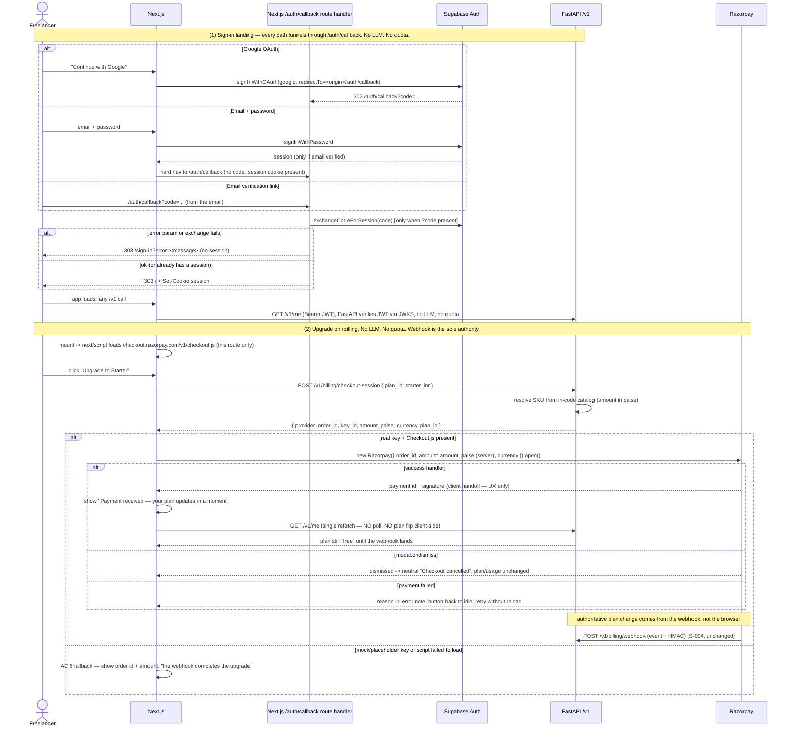

# Slice: S-006 — Hosted Razorpay Checkout.js + `/auth/callback`

| Field | Value |
|---|---|
| **Slice ID** | S-006 |
| **Phase** | 2 AI + money |
| **Status** | Specified |
| **Owner** | PM / 2026-08-29 |

> **Pre-launch finishing touches deferred from Wave 4.** S-004 wired `POST /v1/billing/checkout-session`
> and opens `window.Razorpay` *when* checkout.js and a real key happen to be present. This slice
> actually loads the hosted Razorpay **Checkout.js** `<script>` into the `/billing` upgrade flow and
> handles success / failure / dismiss, and adds the Next.js **`/auth/callback`** route for the
> Supabase Auth redirect landing (email verify + Google OAuth code exchange). **No new `/v1`
> endpoint. No LLM call and no quota anywhere near checkout or callback. The webhook stays the sole
> source of truth for the plan upgrade — client-side success is UX only.** `mock` stays the CI
> default; no live keys in CI.

---

## User story

**As an** India-based freelancer on Free
**I want** a real hosted Razorpay payment window when I upgrade, and a working sign-in redirect after
verifying my email or using Google
**So that** I can pay for Starter without leaving the app and I actually land back signed in

---

## Acceptance criteria

**Hosted Razorpay Checkout.js (web `/billing`)**

1. **Given** the `/billing` route, **when** it mounts, **then** the hosted Razorpay Checkout.js
   `<script>` (`https://checkout.razorpay.com/v1/checkout.js`) is loaded (e.g. via `next/script`) and
   `window.Razorpay` becomes available; **no other route loads that script**.
2. **Given** a Free user (within **or** over quota) and a real, non-mock `NEXT_PUBLIC_RAZORPAY_KEY_ID`,
   **when** they click "Upgrade to Starter", **then** `POST /v1/billing/checkout-session` is called
   once and the hosted Razorpay modal opens with the server-returned `provider_order_id`,
   `amount_paise`, `currency` (INR), and key — the amount displayed is the catalog **₹500** from the
   server response and is never computed or altered client-side (`mvp-spec.md` §5.1, §0.3).
3. **Given** the modal is open, **when** the Razorpay success handler fires, **then** the UI shows a
   "Payment received — your plan updates in a moment" confirmation and re-fetches `GET /v1/me`; the
   client **does not** itself set the plan to Starter — it reflects Starter only once `/v1/me` returns
   it (i.e. after the webhook has run).
4. **Given** the modal is open, **when** the user dismisses it (`modal.ondismiss`), **then** the flow
   returns to the default `/billing` state with a neutral "Checkout cancelled" note, no error styling,
   plan and usage unchanged.
5. **Given** the modal is open, **when** `payment.failed` fires, **then** an error note with the
   Razorpay-supplied reason is shown, the button returns to its idle label, plan and usage unchanged,
   and the user can retry without reloading.
6. **Given** `NEXT_PUBLIC_RAZORPAY_KEY_ID` is missing / a mock / placeholder key, **or** the
   Checkout.js script failed to load, **when** the user clicks "Upgrade to Starter", **then** the flow
   degrades to the S-004 behavior (show the created order id + amount, tell the user the webhook
   completes the upgrade) — no crash, no unhandled promise rejection.
7. **Given** the entire checkout flow, **then** the only `/v1` call made is the existing
   `POST /v1/billing/checkout-session`; **no LLM call and no quota change** occur anywhere
   (`docs/ai-touchpoints.md` unchanged; success = **+0** quota, failure = **+0** quota).
8. **Given** the browser reports payment success but no webhook is received, **then** the user's
   `plan_id` stays `free` and usage is unchanged — the client success handoff never mutates server
   state (`docs/architecture-sequences.md` §6: "authoritative state change comes from the webhook").

**`/auth/callback` route (web)**

9. **Given** a new `/auth/callback` route in the Next.js app, **when** Supabase redirects there after
   email verification or Google OAuth with a `code`, **then** the route exchanges the code for a
   session via the Supabase client SDK (`@supabase/ssr`) and, on success, redirects to `/` (or to a
   `next` / `redirectTo` param **only if** it is a same-origin app path).
10. **Given** `/auth/callback` is reached with an `error` param or the code exchange fails, **then**
    the user is redirected to `/sign-in` with a visible error message and **no** session is set.
11. **Given** `/auth/callback` is reached with no `code` and no session (unauthenticated), **then**
    the user is redirected to `/sign-in`; the route is publicly reachable (`/auth` is already in the
    middleware `PUBLIC_PATHS`).
12. **Given** the sign-in page, **when** the user clicks "Continue with Google", **then**
    `signInWithOAuth` uses `redirectTo = <origin>/auth/callback` (not `/`), so the OAuth `code` lands
    on the callback route.
13. **Given** the callback only touches Supabase Auth, **then** it makes **no** `/v1` call and adds
    **no** business logic to a Next.js route handler — the handler does only the Supabase code
    exchange plus the redirect (`frontend/CLAUDE.md` boundary; `CLAUDE.md` non-negotiable 5).

**Guardrails / CI / docs**

14. **Given** CI with no real Razorpay key and a mock Supabase, **then** `typecheck` + `jest` +
    `next build` pass; Checkout.js is not executed under jsdom; the `/billing` test asserts the
    mock-key fallback path (AC 6) and the callback test asserts the redirect-to-`/sign-in`-on-error
    path (AC 10).
15. **Given** the slice, **then** `mvp-spec.md` is untouched; `docs/ai-touchpoints.md` is unchanged
    (two AI hops, checkout/login rows still "No / No"); `docs/architecture-sequences.md` §1 and §6 are
    updated only where the journey wording changed (callback hop in §1, hosted-script note in §6); the
    `docs/roadmap.md` row "Razorpay Checkout.js integration + `/auth/callback`" is marked done /
    removed.

---

## Out of scope

- Any change to the `POST /v1/billing/checkout-session` contract or the `POST /v1/billing/webhook`
  handler — both are frozen as delivered in S-004.
- Client-side Razorpay signature verification / a `POST /v1/billing/verify` endpoint — v0 relies on
  the webhook alone (roadmap).
- Instant plan flip after payment (polling loop / websocket / server push) — the user just re-opens
  `/billing` or refreshes; near-real-time reflection is a roadmap item.
- Recurring billing (Razorpay Subscriptions API) — v0 stays one-time orders per period (from S-004).
- Real signed storage URLs (roadmap, tracked from S-003).
- Global `$` rail / Stripe (roadmap).
- Playwright E2E of sign-in → pay (roadmap: "Playwright E2E").
- Cross-origin or arbitrary `next` redirect targets from `/auth/callback` (same-origin app paths only).

---

## Dependencies

- `S-004` (Accepted) — the `checkout-session` response shape (`provider_order_id`, `amount_paise`,
  `currency`, `key_id`), the `window.Razorpay` open path, and the `/billing` page.
- `S-002` (Accepted) — the Next.js `@supabase/ssr` auth + middleware guard and the `/sign-in` page.

---

## Definition of done (PM)

- [ ] All 15 AC verified in the test report (Jest; Checkout.js + Supabase Auth stubbed/offline)
- [ ] `NEXT_PUBLIC_RAZORPAY_KEY_ID` unset / mock key stays the CI default; no live Razorpay or
      Supabase keys in CI
- [ ] The webhook remains the only thing that upgrades a plan; client success is UX only (AC 3, 8)
- [ ] `docs/ai-touchpoints.md` + `mvp-spec.md` unchanged (verify `git diff --stat`)
- [ ] `docs/architecture-sequences.md` §1 / §6 reflect the callback + hosted-script wording
- [ ] `docs/roadmap.md` row updated; any new "later" idea filed there in the same PR
- [ ] `README.md` wave/slice status table updated
- [ ] Parity check passes (no SYNC_GROUP file touched)
- [ ] PM `Status` set to **Accepted**

---

## Technical specification (Architect)

> **Frontend-only slice.** No `/v1` route is added or changed. Two decisions resolved by the user and
> baked in below: (1) `/auth/callback` **always** redirects to `/` — no `next` / `redirectTo` param in
> v0; (2) **every** post-auth landing (Google, email verify, *and* S-002's email/password sign-in)
> funnels through `/auth/callback`; (3) instant plan flip after payment is **out of scope** — AC 3 is
> one `GET /v1/me` refetch. Auth-redirect decision recorded in
> [`ADR-004`](../adrs/ADR-004-auth-redirect-callback.md).

### Architect clarifications to the AC (open questions resolved by the user, 2026-08-29)

Build and test to these — they narrow, not widen, the AC as written:

- **AC 9** — drop the "same-origin `next` / `redirectTo`" clause. `/auth/callback` on a successful
  code exchange redirects to **`/`, unconditionally**. No `next` / `redirectTo` param is read or
  supported in v0. (Deep-link-back-after-login, open-redirect-guarded, is a roadmap item.)
- **AC 12** — generalises beyond Google. **Every** post-auth landing routes through `/auth/callback`:
  Google OAuth (`redirectTo`), email-verification links (Supabase redirect config), **and** S-002's
  existing email/password sign-in (hard-nav to `/auth/callback` on `signInWithPassword` success).
- **AC 3** — stays a single `GET /v1/me` refetch after checkout success. No bounded poll, no server
  push, no client-side plan flip (roadmap).

### Files

```
frontend/src/app/auth/callback/route.ts        # NEW — GET handler: Supabase code-exchange (@supabase/ssr) + 303 redirect. NO /v1 call, NO domain logic.
frontend/src/app/auth/__tests__/callback.test.ts  # NEW — error param / failed exchange -> /sign-in ; ?code ok -> / ; no code + no session -> /sign-in
frontend/src/app/sign-in/page.tsx              # Google redirectTo -> `${origin}/auth/callback`; email/password success -> window.location.assign("/auth/callback") (hard nav so the handler runs)
frontend/src/app/billing/page.tsx              # load Checkout.js via next/script (this route only); handler + modal.ondismiss + rzp.on("payment.failed"); success -> pending note + me.refetch(); keep the S-004 mock-key / no-script fallback
frontend/src/app/__tests__/billing.test.tsx    # AC6 fallback already covered; add dismiss + payment.failed cases with a fake window.Razorpay
frontend/src/lib/api.ts                        # unchanged — api.checkout() / api.getMe() already return everything needed
frontend/src/lib/supabase/middleware.ts        # unchanged — `/auth` is already in PUBLIC_PATHS
```

### API contract

| Method | Path | Auth | Request | Response | Errors |
|---|---|---|---|---|---|
| — | *(no new or changed `/v1` endpoint)* | — | — | — | — |
| POST | `/v1/billing/checkout-session` *(S-004, frozen)* | Bearer JWT | `{ plan_id: "starter_inr" }` | `{ provider_order_id, key_id, amount_paise, currency, plan_id }` | `401` no JWT · `4xx` unknown plan |
| GET | `/v1/me` *(S-001, frozen — the AC 3 post-success refetch)* | Bearer JWT | — | `{ user, plan, usage }` | `401` |
| GET | `/auth/callback` *(Next.js route handler, **not** `/v1`)* | Supabase session cookie / PKCE code | query: `code?`, `error?`, `error_description?` | `303` redirect (`Location: /` or `/sign-in?error=…`) + `Set-Cookie` session on success | never `5xx` — any exchange failure → `303 /sign-in?error=…` |

### Data model impact

- [x] None  [ ] Extend existing  [ ] New table(s) — Alembic migration: **no**
- No table, column, or migration. No backend code changes at all.

### Inference & money (cross-ref `docs/ai-touchpoints.md`)

- **LLM call in this slice?** No — nowhere. The only network calls are `POST /v1/billing/checkout-session`,
  `GET /v1/me`, the Razorpay-hosted Checkout.js modal (Razorpay's own domain), and the Supabase Auth
  code-exchange. The two v0 AI hops (`POST /v1/proposals`, `.../regenerate`) are untouched.
- **Quota effect:** none. Checkout success = **+0**, checkout failure/dismiss = **+0**, callback = **+0**.
  No `UsageRecords` write on any path here.
- **Who sets prices:** FastAPI, from the in-code SKU catalog (`payments/catalog.py`, `mvp-spec.md`
  §5.1). The client passes `order.amount_paise` / `order.currency` **straight from the
  `checkout-session` response** into the Razorpay modal — it never computes, multiplies, or overrides
  an amount. The static "₹500/mo" on the offer card is a display label only and is sent nowhere.
- **Failure behavior:** browser "payment success" is UX only — it shows a *pending* confirmation and
  refetches `GET /v1/me`; it never writes server state. `plan_id` flips to `starter_inr` **only** when
  the Razorpay HMAC webhook runs (`docs/architecture-sequences.md` §6, unchanged). If the webhook
  never arrives, the user stays on `free`.
- **`docs/ai-touchpoints.md` needs NO edit** — verified: the "Sign in / session", "Create checkout
  session", and "Billing webhook" rows stay `LLM call? No` / `Quota? No`; invariant 5 ("checkout,
  webhook, login → zero model calls, zero quota") still holds.

### Side effects

- **Webhook idempotency:** unchanged — `WebhookEvents.provider_event_id` unique, duplicate → `200`
  no-op (S-004). This slice does not touch the webhook route.
- **Client success is not authoritative:** AC 3 / AC 8 — the success handler does `me.refetch()` once
  and renders whatever `/v1/me` returns; no polling loop, no websocket, no optimistic `plan = starter`.
- **Redirect-target allowlist:** not applicable — `/auth/callback` has a single hard-coded target
  (`/`) and an error target (`/sign-in`). No user-controlled redirect input is parsed.
- **Checkout.js `<script>`:** third-party, loaded from `https://checkout.razorpay.com/v1/checkout.js`
  via `next/script` (`strategy="afterInteractive"`) on `/billing` **only**. If a CSP is added later it
  needs a `script-src` / `frame-src` allowance for `checkout.razorpay.com` (roadmap note).
- **PDF cache / storage TTL / rate limits:** untouched.

### Frontend

- **Route(s):**
  - `GET /auth/callback` — **route handler** (`route.ts`), server-side, no UI. Supabase
    `@supabase/ssr` `createServerClient`; `exchangeCodeForSession(code)` when `?code=` present;
    returns `NextResponse.redirect(...)` (303) carrying the session `Set-Cookie`. Branch logic per
    ADR-004: `error` param or throw → `/sign-in?error=…`; `code` ok → `/`; no code + valid session →
    `/`; no code + no session → `/sign-in`.
  - `/billing` — existing client page; gains the `next/script` Checkout.js load + the three Razorpay
    callbacks. Fallback (AC 6) is the S-004 order-summary note.
  - `/sign-in` — existing client page; `redirectTo` for Google becomes `${window.location.origin}/auth/callback`;
    email/password success does `window.location.assign("/auth/callback")` instead of `router.push("/")`;
    reads `?error=` from the URL and shows it.
- **Rendering:** `/auth/callback` = server route handler (no React). `/billing` + `/sign-in` = client
  components (`"use client"`), consistent with the S-002 accepted tradeoff.
- **Components to reuse:** `Nav`, `useResource` (its `refetch` is the AC 3 hook), `money()` from
  `lib/format`, `api.checkout` / `api.getMe` from `lib/api`. No new shared component.
- **Watermark behavior:** unchanged — plan/watermark state comes from `/v1/me` + the proposal DTO;
  this slice does not render a preview or PDF.

### Flow



### Architect checklist

- [x] No `/v1` contract change — `checkout-session` + `/v1/me` + webhook are all consumed exactly as
      S-001/S-004 delivered them; no backend file is touched.
- [x] `docs/ai-touchpoints.md` still accurate — **no edit needed**; no LLM and no quota on any path
      in this slice (checkout, callback, `/v1/me` refetch). Confirmed against invariants 1 and 5.
- [x] Money assembled by FastAPI, stripped from the client — the modal amount is
      `order.amount_paise` from the server response; nothing is computed client-side (spec §9, §0.3).
- [x] Webhook stays the sole authority for the plan upgrade — client success = pending note +
      one `me.refetch()`; no optimistic plan state (AC 3, AC 8).
- [x] `proposal_json` untouched — this slice renders no proposal/preview/PDF.
- [x] Supabase JWT verify only, in FastAPI — `/auth/callback` performs a Supabase Auth *session*
      operation (`exchangeCodeForSession`) + redirect; it does **not** verify JWTs, call `/v1`, or add
      a second auth path. FastAPI remains the only verifier (non-negotiable #6). No passlib.
- [x] No business logic in a Next.js route handler — `/auth/callback` is code-exchange + redirect
      only, asserted in `callback.test.ts` (non-negotiable #5; AC 13; ADR-004).
- [x] Adapters unchanged — `mock` payments + no real Razorpay key + mock Supabase stay the CI
      default; Checkout.js is not executed under jsdom (AC 14).
- [x] No secrets — the only browser key is `NEXT_PUBLIC_RAZORPAY_KEY_ID` (`NEXT_PUBLIC_*`, public by
      design); Supabase anon URL/key are already `NEXT_PUBLIC_*`. Nothing else committed.
- [x] Wave 1 docs — `docs/architecture-sequences.md` §1 and §6 updated in this slice (see below);
      `docs/architecture.md` needs no change (no container / boundary / in-out change); ADR-004 added.

### Wave 1 doc edits made with this slice

- `docs/architecture-sequences.md` **§1** — the Google branch now redirects to `/auth/callback`; a
  new hop shows the route handler exchanging the `code` and every branch (incl. email/password)
  landing via `/auth/callback` → `/`. "No LLM. No quota." note kept.
- `docs/architecture-sequences.md` **§6** — the "open Razorpay hosted checkout" step notes the
  Checkout.js `<script>` is loaded on `/billing` via `next/script`, and the client-success handoff is
  a pending note + a single `GET /v1/me` (no plan flip in the browser). The webhook note and the
  "No LLM anywhere in checkout or webhook. No quota consumed." note are unchanged.
- `docs/ai-touchpoints.md` — **not edited** (verified still accurate).
- `mvp-spec.md` — **not edited**.

### Risks / tradeoffs

- **Route handler touches the Supabase SDK** — close to the "no logic in a route handler" line.
  Bounded to code-exchange + redirect; ADR-004 records the call and the alternative (a client page)
  that was rejected for the token-flash / middleware-race it reintroduces.
- **PKCE verifier must survive as a cookie** — `@supabase/ssr` stores it as one, so the server
  handler can complete the exchange. A cookie-blocked browser fails the exchange and lands on
  `/sign-in?error=…` — the correct, visible outcome.
- **Extra navigation on the email/password path** (`/sign-in` → `/auth/callback` → `/`). Cheap, and
  it removes a second bespoke redirect — one funnel for every sign-in outcome.
- **No near-real-time plan reflection** — after paying, the user may briefly see `free` until the
  webhook lands and they revisit `/billing` (or the `me.refetch()` catches it on a later poll-free
  load). Bounded-poll / server-push is a roadmap item, explicitly out of scope here.
- **Static "₹500/mo" card label** is a client constant, not from a catalog endpoint. The *charged*
  amount is always server-authoritative (`order.amount_paise`). A `GET /v1/plans` catalog is a
  roadmap idea, not v0.
- **Third-party Checkout.js from Razorpay's CDN** — loaded only on `/billing`, `afterInteractive`,
  with an `onError` fallback to the AC 6 path. A future CSP must allowlist `checkout.razorpay.com`.
- **No client-side Razorpay signature verification / `POST /v1/billing/verify`** — v0 leans entirely
  on the HMAC webhook (already a roadmap item from S-004).

---

## Links

- Test plan: [`TP-S-006-hosted-checkout.md`](../test-plans/TP-S-006-hosted-checkout.md)
- Test report: [`TR-S-006-hosted-checkout.md`](../test-reports/TR-S-006-hosted-checkout.md)
- ADR: [`ADR-004-auth-redirect-callback`](../adrs/ADR-004-auth-redirect-callback.md) (the `/auth/callback`
  route handler + "always redirect to `/`" decision). The `checkout-session` + webhook contract is
  unchanged from S-004 / S-001.

---

## Changelog

| Date | Agent | Change |
|---|---|---|
| 2026-08-29 | PM | 15 AC — load hosted Checkout.js in `/billing`, success/failure/dismiss handlers, `/auth/callback` code-exchange route; webhook stays sole authority; no new `/v1`, no LLM, no quota |
| 2026-08-29 | Architect | Tech spec: frontend-only, no `/v1` change, no LLM/quota; `/auth/callback` = route-handler code-exchange + redirect (always `/`), all sign-in paths funnel through it; ADR-004; `architecture-sequences.md` §1 + §6 wording updated; `ai-touchpoints.md` confirmed unchanged. **Status: Specified** |
| 2026-08-29 | Architect | Wave-1 doc edits (lost in an earlier git tangle) re-done on branch `s-006-hosted-checkout`: `architecture-sequences.md` §1 (every sign-in path — Google, email-verify link, email/password — funnels through the redirect-only `/auth/callback`, always to `/`, `?error=`/failed-exchange → `/sign-in?error=…`, "No LLM. No quota." kept) + §6 (hosted Checkout.js via `next/script` on `/billing` only, amount straight from the `checkout-session` response, success = pending note + one `GET /v1/me` with no client-side plan flip, `modal.ondismiss` + `payment.failed` branches, missing/mock-key or script-load-failure → S-004 order-summary fallback, webhook-authority + "No LLM / no quota" notes kept); `roadmap.md` Checkout.js/`/auth/callback` row repointed to S-006 `planned` + new `deferred` rows for deep-link-back and near-real-time plan reflection + `idea` row for `GET /v1/plans`; `README.md` slice table row added. `architecture.md` unchanged (no container / trust-boundary / in-out change — `/auth/callback` is inside the existing Next.js container, FastAPI stays sole JWT verifier); `ai-touchpoints.md` unchanged (verified: "Sign in / session", "Create checkout session", "Billing webhook" rows all still `No / No`); `mvp-spec.md` untouched. **Status: Specified** |
| 2026-08-29 | Builder | `frontend/src/app/auth/callback/route.ts` (NEW — `GET`: `@supabase/ssr` `exchangeCodeForSession` when `?code=`, else session check; 303 to `/` on success, `/sign-in?error=…` on `?error=`/throw, `/sign-in` when no code + no session; no `/v1` call, no domain logic) + `callback.test.ts` (6 tests). `sign-in/page.tsx` — Google `redirectTo` → `${origin}/auth/callback`; `signInWithPassword` success → `window.location.assign("/auth/callback")` hard-nav; reads `?error=` from the URL. `billing/page.tsx` — Checkout.js via `next/script` (`afterInteractive`, `onError` → fallback flag) on `/billing` only; `handler` → pending note + one `me.refetch()`; `modal.ondismiss` + `rzp.on("payment.failed")`; mock/placeholder key or script failure → S-004 order-summary fallback; modal amount taken verbatim from the `checkout-session` response. `sign-in.test.tsx` (NEW, 4 tests) + `billing.test.tsx` (+4: hosted success/dismiss/failed, fallback). No backend change. 25 frontend jest, tsc + `next build` green (`/auth/callback` = `ƒ` dynamic). |
| 2026-08-29 | Tester | `TP-S-006` + `TR-S-006` written. Ran `npx jest` (25 → **28** after +3 Tester tests), `npx tsc --noEmit` (0), `npx next build` (9 routes, `/auth/callback` = `ƒ` dynamic), backend `pytest -q` (**61, unchanged from `main`**), `git diff main -- mvp-spec.md docs/ai-touchpoints.md` (**empty**). Tester tests added in the Builder's files: AC 1 source-scan (`checkout.razorpay.com` referenced by `billing/page.tsx` only — the "no other route" clause), AC 2 (`currency == "INR"` + exactly one `checkout` call — money invariant), AC 9 (route handler reads no `next`/`redirectTo` param; `?next=` present → still redirects to `/`). **15 / 15 AC mapped** — 13 automated, 2 automated + pre-launch manual (real Razorpay modal M-004, real Supabase OAuth M-005). No production bug. Non-blocking nit: `README.md` + `roadmap.md` status strings still read "Builder pending". **Recommendation: Ship.** |
