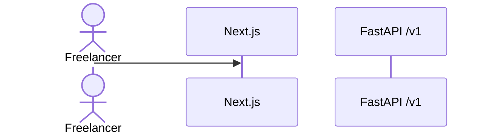

# Slice: S-XXX — [Short title]

| Field | Value |
|---|---|
| **Slice ID** | S-XXX |
| **Phase** | 0 Bootstrap \| 1 Platform skeleton \| 2 AI + money \| 3 v1.1 |
| **Status** | Draft \| Specified \| In Progress \| Testing \| Accepted |
| **Owner** | PM name / date |

---

## User story

**As a** freelancer
**I want** [action]
**So that** [benefit]

---

## Acceptance criteria

1. **Given** … **When** … **Then** …
2. …
3. …

> Cover: unauthenticated (`401`), not-your-row (`404`), and — if pricing is involved — the money
> invariant (saved amounts == user's, model cannot change them). If quota is involved, state the
> counter effect (+1 on success, +0 on fail/empty).

---

## UX notes

- Route(s):
- States: default / empty / loading / error
- Watermark behavior (Free plan) if the slice touches preview or PDF:
- Components to reuse:
- No "Export JSON" / JSON editor anywhere (standing rule — restate if this slice adds an editor).

---

## Out of scope

-

---

## Dependencies

- S-XXX (must be Accepted first)

---

## Definition of done (PM)

- [ ] All AC verified in the test report
- [ ] UX matches the notes above
- [ ] `docs/roadmap.md` updated if a "later" idea came up (same PR); `mvp-spec.md` untouched
- [ ] `README.md` wave/slice status table updated
- [ ] PM `Status` set to **Accepted**

---

## Technical specification (Architect)

> Filled by the Architect before any Builder work. Checked against `docs/architecture-sequences.md`
> and `docs/ai-touchpoints.md`.

### API contract

| Method | Path | Auth | Request | Response | Errors |
|---|---|---|---|---|---|
| | | | | | |

### Data model impact

- [ ] None  [ ] Extend existing  [ ] New table(s) — Alembic migration: yes / no
- Tables / fields (per `mvp-spec.md` §6):

### Inference & money (cross-ref `docs/ai-touchpoints.md`)

- LLM call in this slice? where?
- Quota effect:
- Who sets prices (must be FastAPI, from user's saved amounts):
- Failure behavior:

### Side effects

- PDF cache invalidation / rate limits / webhook idempotency / storage TTL:

### Frontend

- **Route(s):**
- **Rendering:** SSR \| client
- **Components:**

### Flow

### Architect checklist

- [ ] API contract defined, `/v1`, matches the Wave 1 sequences
- [ ] Data model impact documented; Alembic migration noted (never `create_all`)
- [ ] `docs/ai-touchpoints.md` still accurate for every path touched
- [ ] Money assembled by FastAPI before the model; model output price-stripped
- [ ] `proposal_json` stays server-only; responses are the view DTO
- [ ] Supabase JWT verify only; adapters used with `mock` viable in CI
- [ ] No secrets in the design

### Risks / tradeoffs

-

---

## Links

- Test plan: `docs/agents/test-plans/TP-S-XXX-*.md`
- Test report: `docs/agents/test-reports/TR-S-XXX-*.md`
- ADR: `docs/agents/adrs/ADR-XXX-*.md` (if any)

---

## Changelog

| Date | Agent | Change |
|---|---|---|
| | PM | Created slice |
