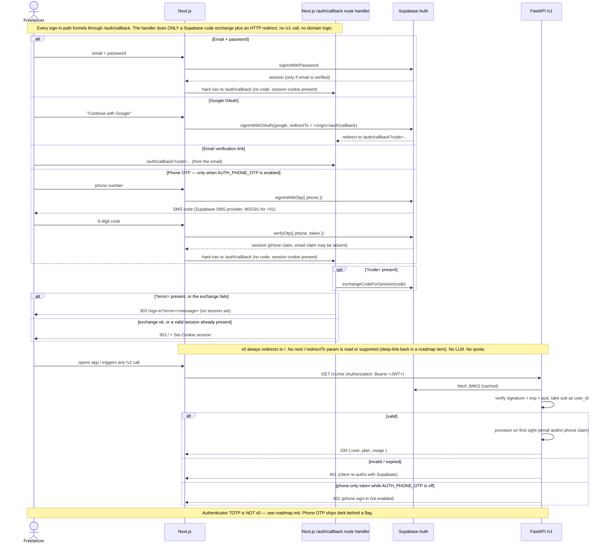
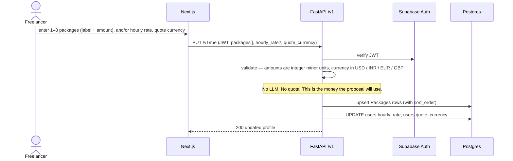
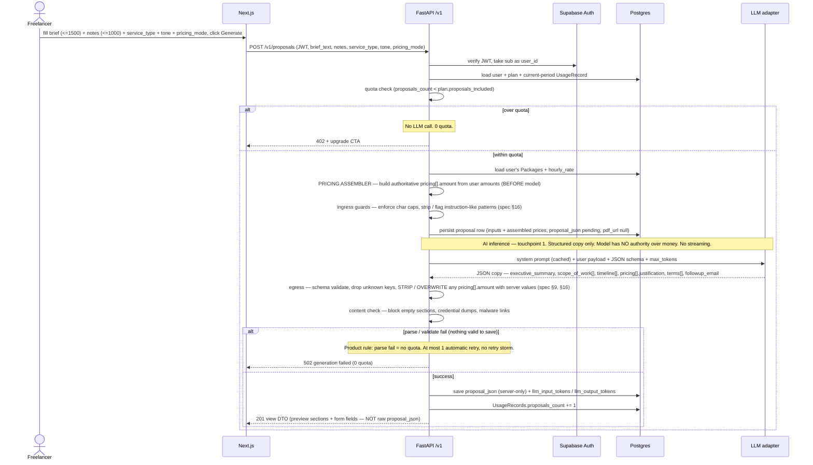
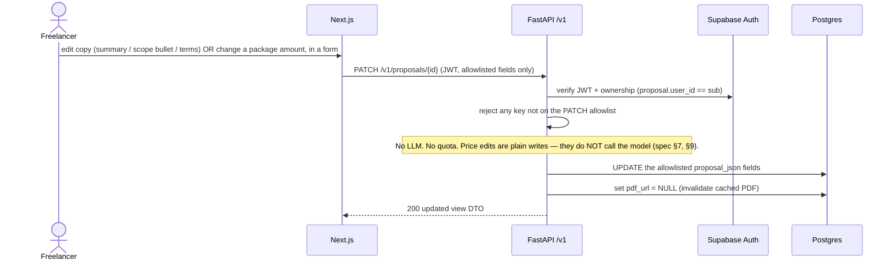
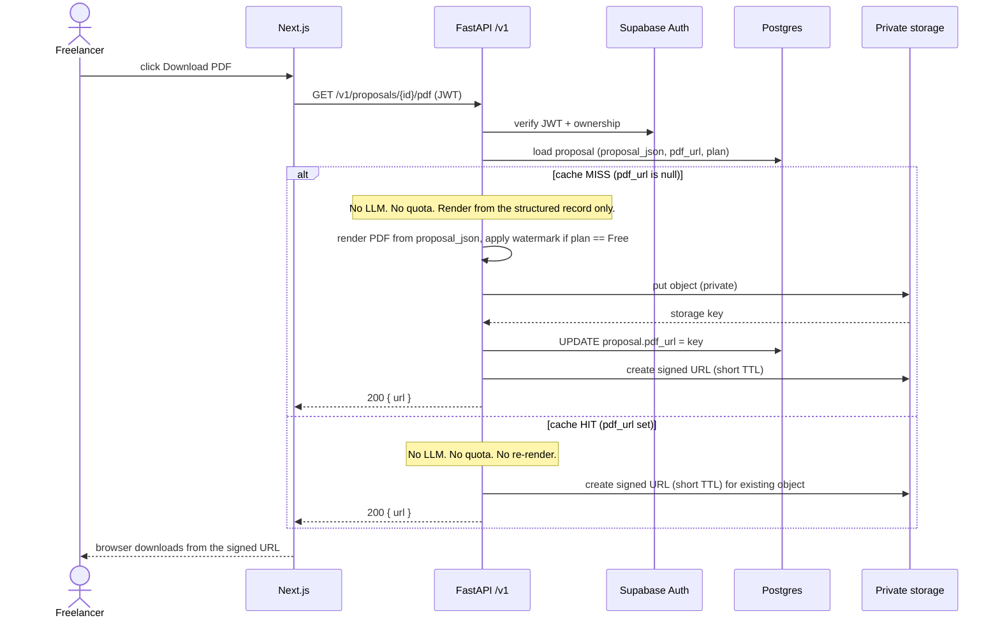
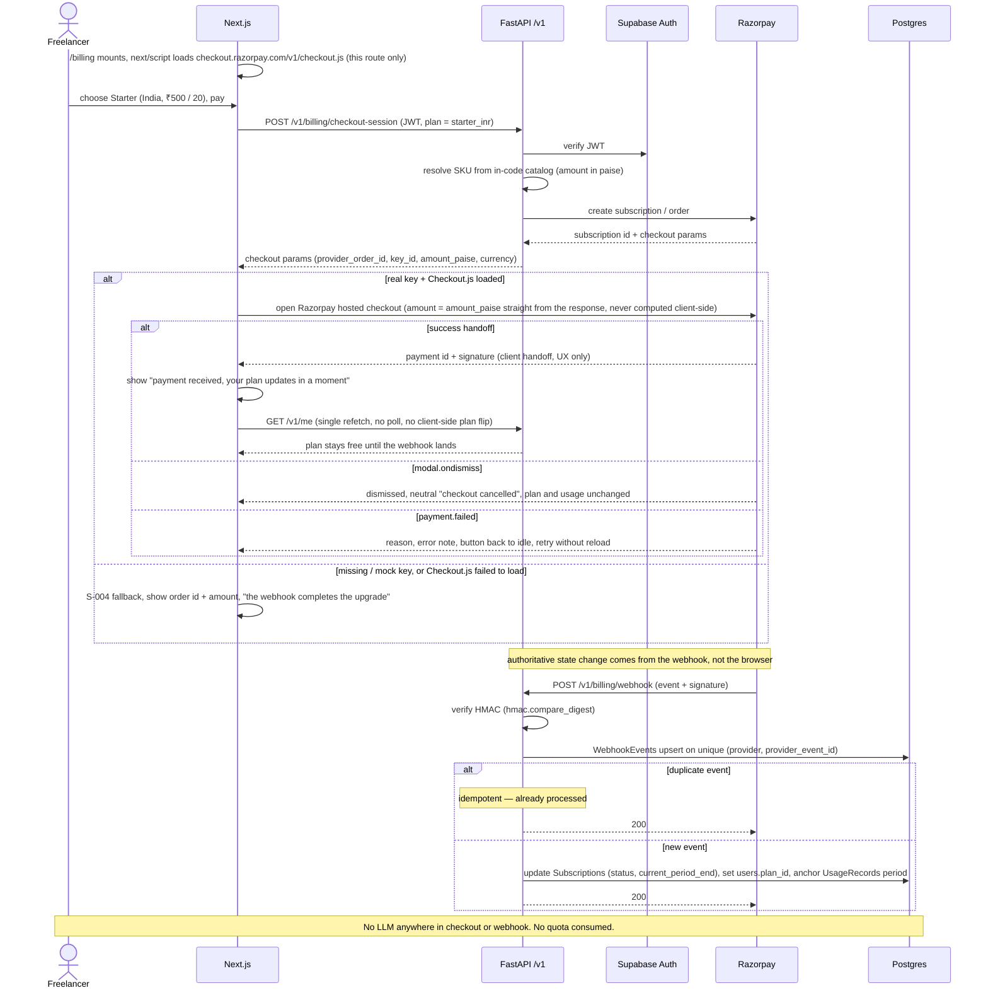
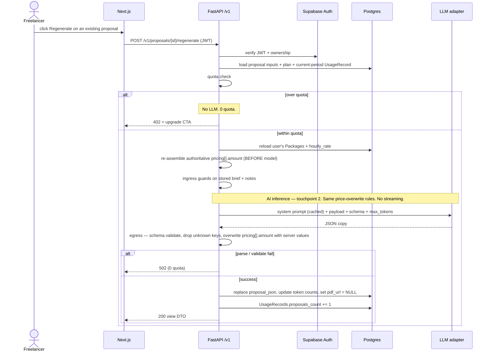
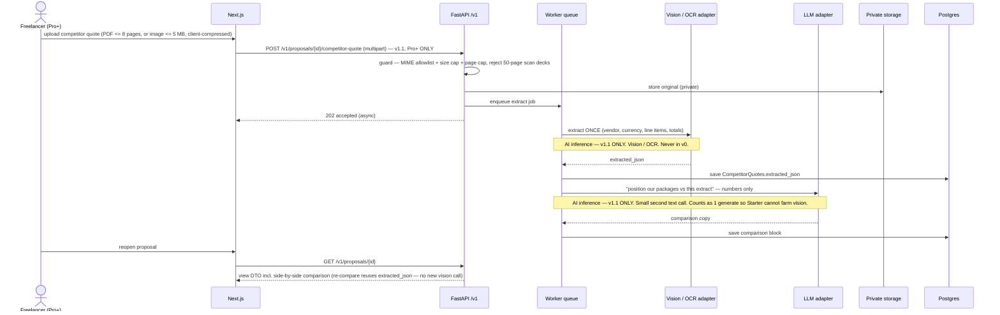

# AIProposer — Architecture sequences (v0)

**Status:** Wave 1 deliverable. Binding for Waves 2–4.
**Companion docs:** [`architecture.md`](architecture.md) · [`ai-touchpoints.md`](ai-touchpoints.md) · [`../mvp-spec.md`](../mvp-spec.md) (FROZEN)

Every diagram below is a v0 user journey. **Every LLM hop carries a `Note` reading "AI inference".**
If a diagram shows the LLM anywhere other than sequences 3 and 7, it is wrong (`mvp-spec.md` §9, §16;
see the v0 AI allowlist in [`ai-touchpoints.md`](ai-touchpoints.md)).

Participant legend: **U** freelancer (browser) · **W** Next.js · **A** FastAPI `/v1` ·
**Auth** Supabase Auth · **DB** Postgres · **LLM** LLM adapter · **S** private storage · **Pay** Razorpay.

> **Build note:**
> - **Wave 3 (S-001/S-002):** wired with the LLM adapter as a deterministic `MockAIProvider` and
>   `pdf_url` stubbed — zero production AI hop.
> - **Wave 4 (S-003):** the real Claude adapter (`AI_PROVIDER=anthropic`, ADR-002) is live at
>   sequences 3 & 7; sequence 5 now renders a real cached PDF (`reportlab`, watermark on Free,
>   invalidated by PATCH). `mock` / stub remain the default and the only thing CI exercises.
>   `AI_PROVIDER` and `PAYMENTS_PROVIDER` still validate at boot. `ai-touchpoints.md` is unchanged —
>   the two AI hops and their rules are exactly as drawn.

---

## 1. Sign in → JWT on the API

Per the AUTH OVERRIDE recorded in [`architecture.md`](architecture.md#auth-override-recorded-once-here-waves-24-inherit-this):
**email/password (verified) + Google.** Phone OTP is an optional method behind `AUTH_PHONE_OTP`
(default off, off in CI — S-005, ADR-003). No TOTP in v0.

Every sign-in path (Google OAuth, the email-verification link, email/password, **and** phone OTP when
`AUTH_PHONE_OTP` is enabled) funnels through one Next.js `/auth/callback` route handler (S-006,
[`ADR-004`](agents/adrs/ADR-004-auth-redirect-callback.md)). That handler does exactly two things — a
Supabase `exchangeCodeForSession` when a `?code=` is present, then an HTTP redirect — **no `/v1` call,
no domain logic.** v0 always redirects to `/` (no `next` / `redirectTo` param). A `?error=` param or a
failed exchange redirects to `/sign-in?error=…` with no session set.

---

## 2. Save rates / packages

---

## 3. Generate — full hop list (price assembly BEFORE the model)

---

## 4. Edit without generate

---

## 5. PDF — first hit vs cache hit

---

## 6. Subscribe — India Starter (Razorpay)

The `/billing` page loads hosted Razorpay **Checkout.js**
(`https://checkout.razorpay.com/v1/checkout.js`) via `next/script` on that route **only** (S-006). The
modal opens with the amount taken **straight from the `POST /v1/billing/checkout-session` response** —
never computed client-side. The browser "success" handler shows a pending note and does a single
`GET /v1/me` refetch; it does **not** flip the plan client-side. A missing / mock key or a
script-load failure degrades to the S-004 order-summary fallback.

---

## 7. Regenerate

Same rules as Generate: quota is checked and consumed, prices are re-assembled from the user's saved
amounts **before** the model, model output is schema-validated and price-stripped.

---

## 8. v1.1 GHOST — competitor upload + extract (NOT v0)

> **This diagram is not v0.** It is drawn so a reviewer can see *where* the second AI hop would live
> if/when competitor compare ships (v1.1, **Pro+ only**, `mvp-spec.md` §17). No v0 endpoint, no v0
> upload surface. Optional second AI hop shown dashed.

---

## Sequence → AI/quota summary

| # | Journey | LLM hop? | Quota? |
|---|---|---|---|
| 1 | Sign in → JWT | No | No |
| 2 | Save rates / packages | No | No |
| 3 | Generate | **Yes — touchpoint 1** | 1 on saved success, 0 on fail |
| 4 | Edit without generate | No | No |
| 5 | PDF first hit / cache hit | No | No |
| 6 | Subscribe India Starter | No | No |
| 7 | Regenerate | **Yes — touchpoint 2** | 1 on saved success, 0 on fail |
| 8 | Competitor upload (v1.1 ghost) | Yes — **v1.1 only**, not v0 | v1.1: 1 generate |
