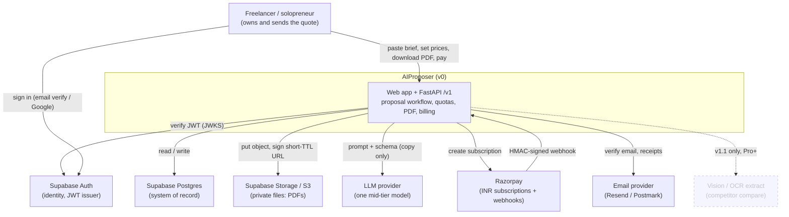
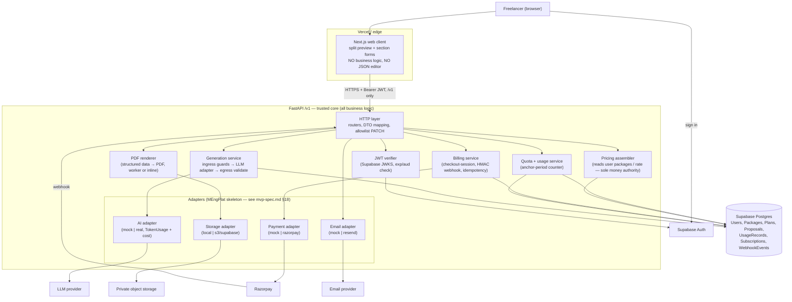
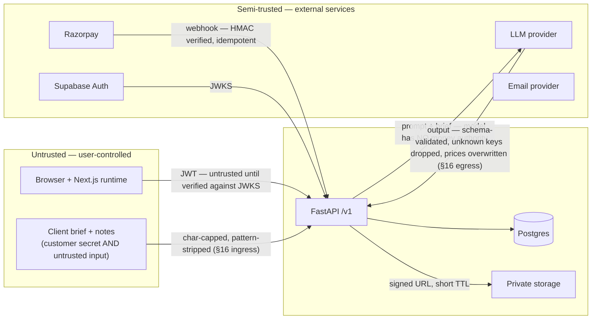

# AIProposer — Architecture (v0)

**Status:** Wave 1 deliverable. Binding for Waves 2–4.
**Source of truth for scope, prices, SKUs:** [`../mvp-spec.md`](../mvp-spec.md) (FROZEN — do not contradict).
**Companion docs:** [`architecture-sequences.md`](architecture-sequences.md) · [`ai-touchpoints.md`](ai-touchpoints.md) · [`roadmap.md`](roadmap.md)

This document transcribes and refines the "End picture" already recorded in
[`claude-implementation-waves.md`](claude-implementation-waves.md). Where this doc and the wave file
disagree, the wave file's canonical mermaid and AI-touchpoint table win and this doc must be corrected.

---

## 1. What v0 is

A **single-operator quote workflow**: one freelancer pastes a client brief, confirms **their own**
package prices or hourly rate, and leaves with a sendable proposal (on-screen preview + cached PDF).
Not a chat transcript, not a JSON export, not a team tool.

- **Backend:** FastAPI, base path `/v1`. All business logic lives here (`mvp-spec.md` §0.2, §8).
- **Web:** Next.js/React. UI only — it talks to FastAPI and nothing else. No business logic in Next.js routes.
- **Identity:** Supabase Auth. FastAPI only *verifies* the JWT; it never issues one and stores no `password_hash` (`mvp-spec.md` §6).
- **One LLM call** behind a Python adapter, on two endpoints only (see §5, `ai-touchpoints.md`).
- **Payments:** Razorpay only. INR rail. Hard caps, no overage packs (`mvp-spec.md` §5, §6, §7).
- **Money on the proposal always comes from the user**, never from a multiplier, never from the model (`mvp-spec.md` §0.3, §9).

### AUTH OVERRIDE (recorded once here; Waves 2–4 inherit this)

> The wave-file checkboxes were left unfilled. Falling back to the frozen spec:
>
> - **v0 auth = Supabase Auth: email/password (verified) + Google OAuth.** (`mvp-spec.md` §3.1, §13.1)
> - **No SMS / phone OTP, no authenticator TOTP in v0.** The India +91 SMS rail is an *open decision*,
>   tracked in [`roadmap.md`](roadmap.md) as `blocked-on-decision`. If it is chosen later, only
>   sequence 1 in `architecture-sequences.md` changes; the JWT-verification contract with FastAPI does not.

---

## 2. System context (C4 level 1)

**Actors:** exactly one — the freelancer who owns the quote. No seats, no admin console, no reviewer role in v0 (`mvp-spec.md` §0.1, §1).

---

## 3. Container diagram (C4 level 2)

### Container responsibilities

| Container | Owns | Must never |
|---|---|---|
| **Next.js web client** | Rendering the PDF-like preview, section forms bound to the same fields, checkout redirect | Hold service keys · compute prices · call the LLM · show or offer raw `proposal_json` (`mvp-spec.md` §0.4, §15.2) |
| **FastAPI HTTP layer** | Routing, request validation, mapping domain → **view DTO**, enforcing the PATCH allowlist (`mvp-spec.md` §7) | Return `proposal_json` as a promoted "export" feature |
| **JWT verifier** | Validate signature against Supabase JWKS, check `exp` / `aud`, extract `sub` as `user_id` | Issue tokens · fall back to custom passlib auth (`mvp-spec.md` §18.2) |
| **Quota + usage service** | Read `UsageRecords` for the current anchor period, block at `proposals_included`, increment **only on a saved successful generation** (`mvp-spec.md` §3.1, §16) | Bill a failed/empty generation · use calendar month instead of subscription anchor |
| **Pricing assembler** | Build authoritative `pricing[].amount` from `Users.hourly_rate` + `Packages.amount_minor` **before** the model runs (`mvp-spec.md` §9) | Accept a price from the model · apply any ×1.6 / ×2.5 multiplier |
| **Generation service** | Ingress guards (char caps, strip instruction-like patterns), call AI adapter with schema + `max_tokens`, egress schema-validate, drop unknown keys, strip/overwrite model prices (`mvp-spec.md` §16) | Stream JSON · retry in a storm (cap 1 automatic retry; parse fail = no quota) |
| **PDF renderer** | Render from the structured record, watermark when plan = Free, write once, cache `pdf_url` | Call the LLM · use headless Chrome on web serverless (`mvp-spec.md` §8) |
| **Billing service** | Create Razorpay subscription, verify webhook HMAC with `hmac.compare_digest`, upsert `WebhookEvents` (unique `provider_event_id`) for idempotency, anchor the period (`mvp-spec.md` §7, §18.1) | Trust an unverified webhook · process a duplicate event twice · call the LLM |
| **Adapters** | One `mock` implementation (CI/offline) + one real implementation each; `TokenUsage` + `estimated_cost_usd` on every AI call; startup validation of missing keys (`mvp-spec.md` §18.1) | Require Redis to boot · ship demo passwords |

---

## 4. Trust boundaries

**Boundary rules (from `mvp-spec.md` §15, §16):**

1. **The client brief is untrusted** — treat it "like a browser treats HTML". It is also a **customer
   secret** (private storage, no training without explicit opt-in, hard-delete).
2. **The JWT is untrusted until verified.** FastAPI checks it on every `/v1` call against Supabase JWKS.
   A request is authorized only for `sub`'s own rows.
3. **The LLM is outside the trust boundary in both directions.** It receives the untrusted brief; its
   output is untrusted data that must be schema-validated and stripped of any money value before it
   touches `proposal_json`.
4. **Money authority is FastAPI alone.** `pricing[].amount` is assembled from the user's saved
   amounts. Any `price`/`amount` the model emits is discarded.
5. **`proposal_json` never leaves the server as a promoted feature.** Clients receive a **view DTO**
   (sections for preview + forms). No "Export JSON", no "copy as markdown dump" (`mvp-spec.md` §0.4, §15.2).
6. **Webhooks are untrusted POSTs** until the HMAC check passes; then de-duplicated via `WebhookEvents`.
7. **Storage URLs are signed and short-lived.** No public bucket, no PDF at a guessable path.

---

## 5. Where AI inference runs (v0 allowlist)

**Two places only.** Full table with failure behavior in [`ai-touchpoints.md`](ai-touchpoints.md).

| # | Endpoint | When | Model may return | Quota |
|---|---|---|---|---|
| 1 | `POST /v1/proposals` | After JWT verify, after quota check passes, **after** the pricing assembler has copied the user's amounts into the payload | Copy fields only: `executive_summary`, `scope_of_work[]`, `timeline[]`, `pricing[].justification`, `terms[]`, `followup_email` | 1 on a saved success · 0 on fail/empty |
| 2 | `POST /v1/proposals/{id}/regenerate` | Same preconditions, on an existing proposal | Same | 1 on a saved success |

**Everything else is FastAPI-only and must appear that way on the sequences:**
JWT verify · `PUT` / `GET /v1/me` · `GET` list & detail (view DTO) · `PATCH` allowlist (including price
edits) · `GET /v1/proposals/{id}/pdf` · duplicate (clone inputs + last server JSON, no LLM until the
user hits Generate) · `POST /v1/billing/checkout-session` · `POST /v1/billing/webhook`.

**No streaming JSON** in v0 — wait for the object, validate, then render (`mvp-spec.md` §4).

---

## 6. Data model (logical — full schema in `mvp-spec.md` §6)

| Entity | Key fields (v0) | Notes |
|---|---|---|
| **Users** | `id`, `email`, `name`, `quote_currency`, `hourly_rate?`, `billing_country`, `plan_id` | No `password_hash`. `billing_country` derived from the payment rail, not self-declared. |
| **Packages** | `id`, `user_id`, `label`, `amount_minor`, `currency`, `sort_order` | The authoritative money source for a quote. |
| **Plans** | `id`, `name`, `rail` (`inr`/`usd`), `price_minor`, `proposals_included`, `overage_minor?` | SKU catalog in code (`mvp-spec.md` §5.1, §18.1). v0 ships **Free** + **India Starter ₹500 / 20**. |
| **Proposals** | `id`, `user_id`, `client_name`, `client_company?`, `service_type`, `brief_text`, `pricing_mode`, `tone`, `language`=`en`, `status`, `llm_input_tokens`, `llm_output_tokens`, `proposal_json`, `pdf_url?`, timestamps | `proposal_json` is **server-only**. Pricing values inside it are copied user amounts. |
| **UsageRecords** | `period_start`, `period_end` (subscription anchor), `proposals_count` | Incremented only on a saved successful generate/regenerate. |
| **Subscriptions** | `provider`=`razorpay`, customer/subscription ids, `plan_id`, `status`, `current_period_end` | Period anchor written from the webhook. |
| **WebhookEvents** | `provider`, `provider_event_id` (unique) | Idempotency key for billing webhooks. |
| **CompetitorQuotes / Infographics** | — | **v1.1 only.** Present in the model for forward-compat; no v0 endpoints. |

---

## 7. In / out of v0

### In v0

- FastAPI `/v1`; Next.js web client that speaks only to FastAPI.
- Supabase Auth (email verified + Google); JWT verification in FastAPI.
- User-owned prices: saved packages and/or hourly rate × hours; single project fee is valid.
- Split UI: PDF-like preview + section forms. Status `draft` / `sent` / `won` / `lost`.
- One LLM `generate` + `regenerate`, structured JSON, `max_tokens`, cached system prompt, no streaming.
- Server-side PDF from structured data; cached `pdf_url`; invalidated on PATCH; watermark on Free.
- Plans: **Free 3 watermarked, no follow-up email** + **India Starter ₹500 / 20 hard cap**.
- Razorpay checkout-session + HMAC webhook + `WebhookEvents` idempotency + period anchor.
- WhatsApp share = `wa.me` link. Email = verify + receipts.
- Follow-up email copy: paid plans only.
- MEngPlat adapter skeleton: AI / payments / storage / email, each with a `mock` used in CI.
- Duplicate proposal = clone inputs + last server JSON; no LLM until the user Generates.

### Out of v0 (tracked in [`roadmap.md`](roadmap.md))

Flutter / any mobile client · Stripe / global `$` checkout · proposal packs & overage · competitor
compare upload + OCR (v1.1, Pro+) · infographic PNG (v1.1) · general file uploads · seats /
`workspaces` / "Scale" · Hindi UI or output · authenticator TOTP · SMS / phone OTP rail
(`blocked-on-decision`) · single-session enforcement · public product rename · live FX conversion at
checkout · PostHog can land late, is not a launch blocker.

---

## 8. Deployment shape (v0 — `mvp-spec.md` §8)

| Layer | v0 choice |
|---|---|
| API | FastAPI (Python), containerised. Alembic migrations only — no `create_all` in prod. |
| Web | Next.js on Vercel (or equivalent). Talks to FastAPI only. |
| DB | Supabase Postgres. |
| Auth | Supabase Auth. |
| Files | Supabase Storage or S3-compatible; private; signed short-TTL URLs. |
| Payments | Razorpay. |
| LLM | One provider via Python adapter; prompt cache where supported. |
| PDF | Server-side lib (ReportLab / WeasyPrint / worker). Not headless Chrome on serverless. |
| Email | Resend / Postmark. |
| Errors | Sentry. Analytics: PostHog (may land late). |
| Local / CI | `docker-compose`: Postgres (+ Redis optional, fail-open); every adapter in `mock` mode. No live LLM or Razorpay keys in CI. |

**Security baseline:** HTTPS everywhere; JWT on every `/v1` call; rate limit on `POST /v1/proposals`
(per user + per IP) with max 1 concurrent LLM call per user; allowlisted PATCH; private signed storage
URLs; security headers (HSTS only on HTTPS; not `BaseHTTPMiddleware` — see `mvp-spec.md` §18.1).

---

## 9. Spec cross-reference

| Topic | `mvp-spec.md` section |
|---|---|
| Locked v0 decisions | §0 |
| Data model | §6 |
| API design | §7 |
| Infra & deployment | §8 |
| Prompt & pricing (money never from the model) | §9 |
| Token & cost constraints | §4 |
| Pricing & plans (SKUs, unit economics) | §5 |
| Audience, leak, screenshot vs forms | §15 |
| Quality guardrails & prompt/data injection | §16 |
| Competitor compare (v1.1) | §17 |
| MEngPlat salvage (adapters, not domain code) | §18 |
